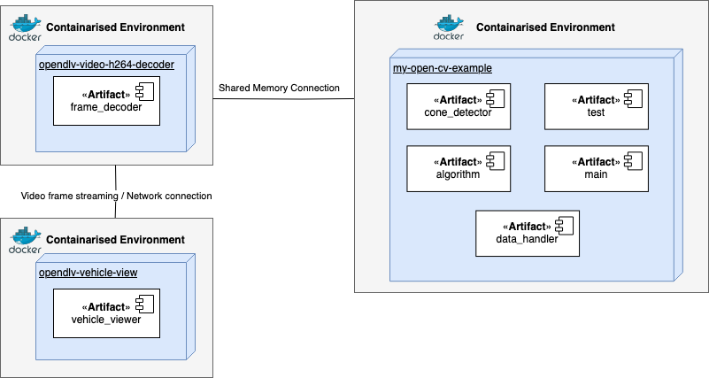
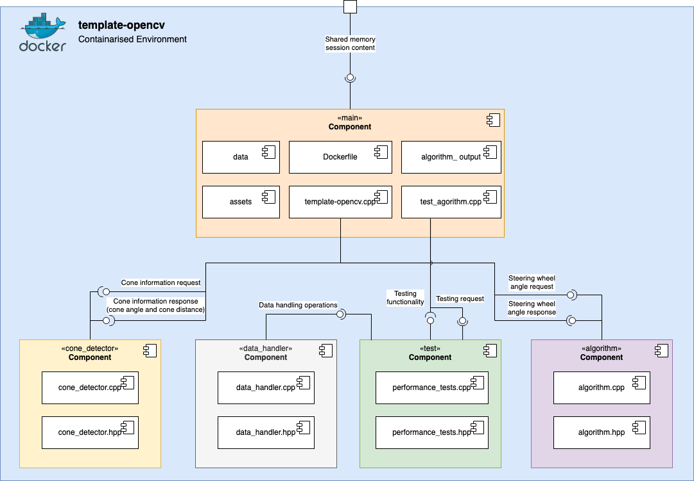

# 2023-group-11

# Autonomous Obstacle Avoidance Steering :racing_car:
Do you have a small scale vehicle that you wish had a simple obstacle avoidence system? Do you have bunch of sensors lying around and space on your raspberry pi? 

These are exactly the problems this project solves! The goal of this project is to create a data-driven algorithm that will take in data from multiple sources and sensors to output a steering value to avoid obstacles. The project is made to run in a docker which can be used by devices such as a raspberry pi. 

## Pre-Requirements

The following instructions require a Linux distribution installed on your machine. Ubuntu 22.04 is recommended.

To make use of the system following sensors are required on the model vehichle:

*The list is not yet complete. Please check again later!*
- Sensor 1
- Sensor 2
- Sensor 3

TODO: Add information on how sensors can pass data to our application.

## Installation

### Make sure that your system is up to date. Run the following in a terminal:
>sudo apt-get update
> 
>sudo apt-get upgrade
> 

### Install software development tools. Run the following in a terminal:
> sudo apt-get update
>
> sudo apt-get install build-essential cmake git
> 

### Install docker

#### 1. For non-Gnome Desktop environments, gnome-terminal must be installed:

> sudo apt install gnome-terminal
> 
#### 2. Uninstall the tech preview or beta version of Docker Desktop for Linux. Run:

> sudo apt remove docker-desktop
> 
For a complete cleanup, remove configuration and data files at $HOME/.docker/desktop, the symlink at /usr/local/bin/com.docker.cli, and purge the remaining systemd service files.

> rm -r $HOME/.docker/desktop
> 
> sudo rm /usr/local/bin/com.docker.cli
> 
> sudo apt purge docker-desktop

#### 3. Set up the repository

Update the apt package index and install packages to allow apt to use a repository over HTTPS:

> sudo apt-get update
> 
> sudo apt-get install \
> 
> ca-certificates \
> 
> curl \
> 
> gnupg
>
Add Docker’s official GPG key:

>sudo mkdir -m 0755 -p /etc/apt/keyrings
> 
> curl -fsSL https://download.docker.com/linux/ubuntu/gpg | sudo gpg --dearmor -o /etc/apt/keyrings/docker.gpg
>
Use the following command to set up the repository:

> echo \
"deb [arch="$(dpkg --print-architecture)" signed-by=/etc/apt/keyrings/docker.gpg] https://download.docker.com/linux/ubuntu \
"$(. /etc/os-release && echo "$VERSION_CODENAME")" stable" | \
> sudo tee /etc/apt/sources.list.d/docker.list > /dev/null

#### 4. [Download latest DEB package.](https://desktop.docker.com/linux/main/amd64/docker-desktop-4.17.0-amd64.deb?utm_source=docker&utm_medium=webreferral&utm_campaign=docs-driven-download-linux-amd64)

#### 5. Install the package with apt as follows:

>sudo apt-get update
> 
>sudo apt-get install ./docker-desktop-<version>-<arch>.deb
> 
#### 6. Give admin privileges to docker for easier use. (optional)

> sudo adduser ubuntu docker

## Usage

### 1. Clone the repository

In a terminal, use the following command:

> git clone https://git.chalmers.se/courses/dit638/students/2023-group-11.git

### 2. Build the docker image

> docker build -t antongol/example:latest -f Dockerfile .
>

### 3. Run the docker image

> docker run --rm antongol/example:latest 42

## Workflow

Our group will follow a modified version of the git flow. This means that we will **create new branches** from the main branch, on which we will work. However, we will also have a branch called **develop**. The main branch will have only production code, and every modification (merge request from develop branch) on it will be a new release. The **develop** branch will have **pre-production code** and when features are finished they will be merged from the aforementioned individual feature branches into this branch, and progress ahead later to main once it has been thoroughly verified. 

### Bug Fixing

Bugs and unexpected behaviors are handled by the team via making a new bug fix issue, if the main feature issue is closed. The same workflow is applied by starting with making a new branch and ending with merging into develop/main.

### Protocol for new additions / features

The team collectively agreed upon a procedure for new feature additions, which goes as follows:

- Pull the latest version of the project
- Checkout to a new branch
- Make changes / modifications, then commit & push
- Open a Pull Request (PR) to the **develop** branch
  - **Approval**: The program should be built successfully, passed tests, and upon so, is to be reviewed by a **maintainer**

We will also follow **test-driven development** principles, in order to accurately determine that our implementation fulfills the requirements, as well as to improve code quality. This means that we will *create unit tests* based on the requirements and will then develop our software so that it passes all of them. 
 
- If **approved**: Changes are pushed to the **develop** branch

Code reviews will be an important part of the workflow as well. Each merge request to develop will be carefully reviewed by at least one other team member, and meaningful feedback will be given. If the PR is not approved, changes will need to be done. Each merge request to main will close issues related to the commits added.

- A second PR is initiated, for adding approved features as an eventual **official patch/release**.
  - Same aforementioned approval process needs to be conducted with a fellow **maintainer**.
- If **approved**: Pushed to the **main** branch, and a new tag, in the form of a release is created. It must follow correct versioning more than the current state, in the form vX.X.X.  

## Software Design

### Dependencies
Our algorithm software depend on two other microservices.
 - The h264-decoder’s main purpose is to create image frames which can be processed by our image analysis implementation, ensuring the accurate extraction of relevant information for cone detection.
 - opendlv-vehicle-view is another component, as shown in the deployment diagram which can create image frames in an h264 format that can be decoded to be further processed by an algorithm to extract its relevant information.

### Structure
The description for the components are as follows: 

 - cone_detector: frame processing with HSV filtering and object detection with the goal of detecting cones **(DEPRICATED)**
 - data_handler: performes input and output for csv files
 - test: contains various types of methods used for testing
 - algorithm: contains the logic which calculates the steering wheel angle

## Tools

### **Code Analysis**

These are the tools that we intend to use in order analyze and improve te quality of the C++ code developed. 

Each tool has its own **strengths** and **weaknesses**
 and can be used to improve different aspects of code quality. Using a combination of these tools can help ensure that **C++ code is of high quality, maintainable, and secure**.

  
Clang-tidy

[Clang-tidy](https://clang.llvm.org/extra/clang-tidy/) is a static analysis tool built on top of the Clang compiler for C++ code that can detect fixes for bugs, coding violations, and performance issues. Clang-tidy can generate reports with detailed information on issues, including their severity, location, and suggestions for remediation. It supports manny coding standards, including Google C++ Style Guide and LLVM Coding Standards, and can also be customized with user-defined checks

  
Cppcheck

[Cppcheck](https://cppcheck.sourceforge.io/) is a static analysis tool for C++ code that can detect fixes for bugs, coding violations, and security issues. It analyzes the code for various types of errors: buffer overflows, null pointer dereferences, and memory leaks. Moreover, it can generate reports with detailed information on the issues found.

  
OCLint

[OCLint](https://oclint.org/) is a static code analysis tool that can detect bugs, coding violations, and design issues in C++, C, and Objective-C codebases. It works by analyzing the code's abstract syntax tree and generating reports on the issues found. OCLint supports a range of coding standards, can be customized.

  
Pmccabe

[PMCCabe](https://manpages.ubuntu.com/manpages/focal/man1/pmccabe.1.html) is a software complexity analysis tool that is used to measure the complexity of C++ code. It analyzes the code's control flow graph and generates reports providing information on various complexity metrics, such as: cyclomatic complexity, essential complexity, and design complexity. The reports can be used to identify code that is difficult to maintain, understand, or test, and to make decisions about code refactoring and optimization.

  
lCov

[lCov](https://wiki.documentfoundation.org/Development/Lcov) is a code coverage analysis tool for C++ code that can be used to measure the effectiveness of test suites when exercising the codebase. It works by generating reports that provide information on the percentage of code executed by the tests.

  
doctest

[doctest](https://github.com/doctest/doctest) is a high-performance testing framework for C++ that is built on Catch testing framework. However, doctest has a significantly lower compile runtime while executing test cases. We will use doctest framework in order to implement and enhance test-driven development testing before creating new features. 

## Commit  & Pull Request Conventions

All commits and pull requests follow [Conventional Commits](https://www.conventionalcommits.org/en/v1.0.0/). 
The convention dictates that the messages will start with a keyword which specifies the type of change. It is then followed by a description of the change.

Few common keywords:
- feat = adds a new feature
- fix = fixes a bug
- docs = works on readme type documents
- ci = related to CI/CD
- test = related to tests
- ! = used in addition to other keywords to represent importance or impact of change

*feat!: added markdown to textboxes*

*docs: added the commit & merge request conventions section to readme*

## CI/CD Pipeline

The project contains four pipeline stages:

**Build** 
- Builds the project. 
- A new docker image tag is newly created under the group's container registry (can be found in Packages and Registries > Container Registry). The name of the tag should be a correctly formatted version ID of the form **vX.X.X**.

**Test**  all tests are excecuted five times with the five different sample data.
- The algorithm is tested to make sure it passes the requirements set by the customers. The following are tested: Accuracy of Algorithm, Total Time Taken, and Frames per Second. 
- Requirement for the accuracy tests to pass is 45% or higher. 
- Requirement for time takes tests requires the algorithm output total time to be same as the total time from given sample data.
- Requirement for frames per second tests require each second to contain 10 frames for 85% of all seconds. 

**Plot** based on passed commit and current commit, five graphs are made. 

**Release** on commits to main, a release tag is given and release is uploaded to docker-hub. 

The stage routines can be found in the repository's root folder, in the file  `.gitlab-ci.yaml`.

## Authors and acknowledgment
Below is the list of developers who are actively working on this project.
- Aditya Khadkikar: @adityaa 
- Anton Golubenko: @antongol
- Burak Askan: @askan
- Dragos Florinel Isar: @florinel
- Oscar Reina Gustafsson: @scarr

## License
This project makes use of the MIT license. No contributions can be done to this project by non-maintainers.

## Project status
Project is on-going. 
